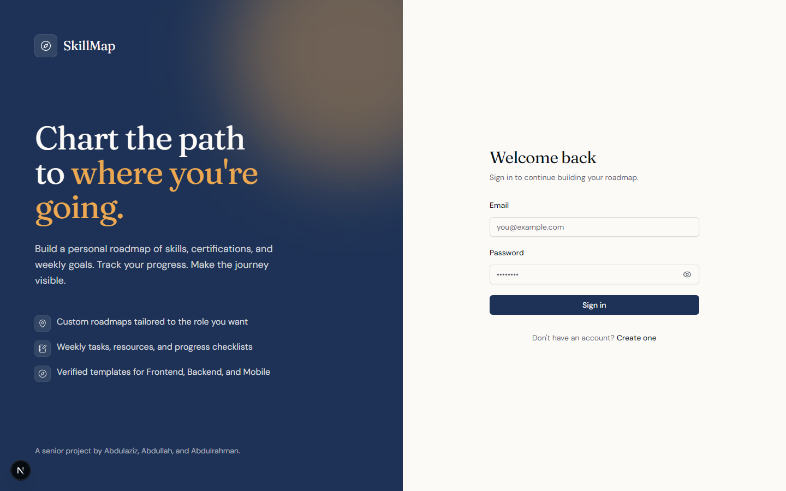
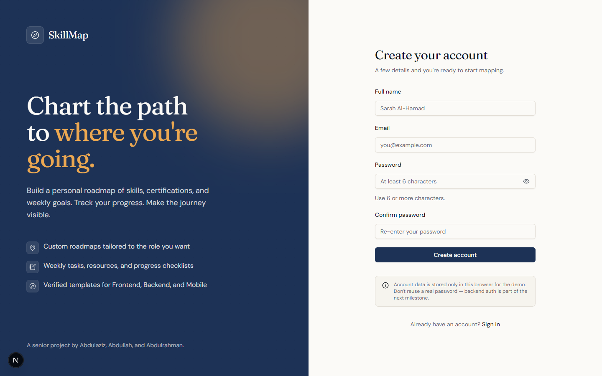
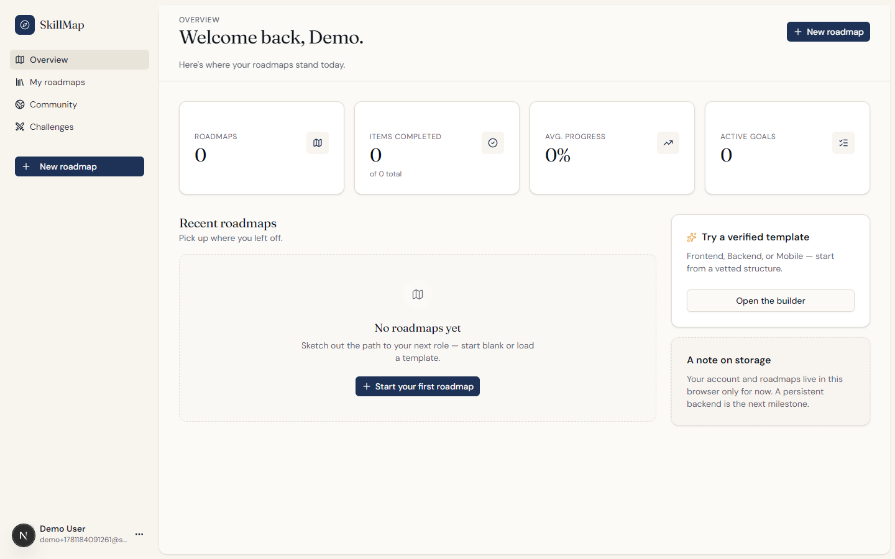
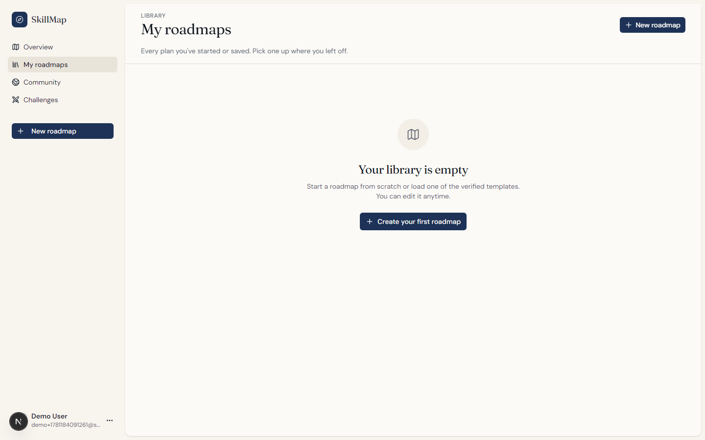
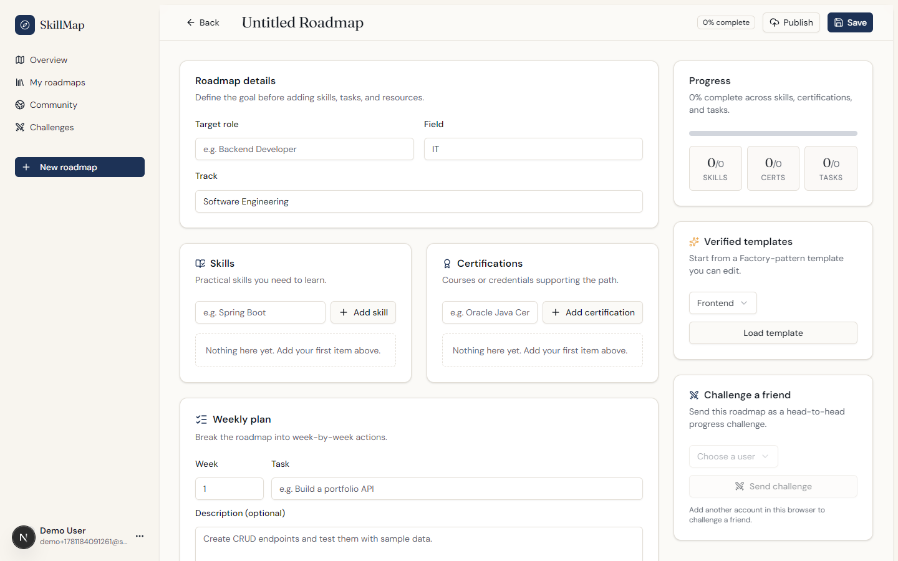
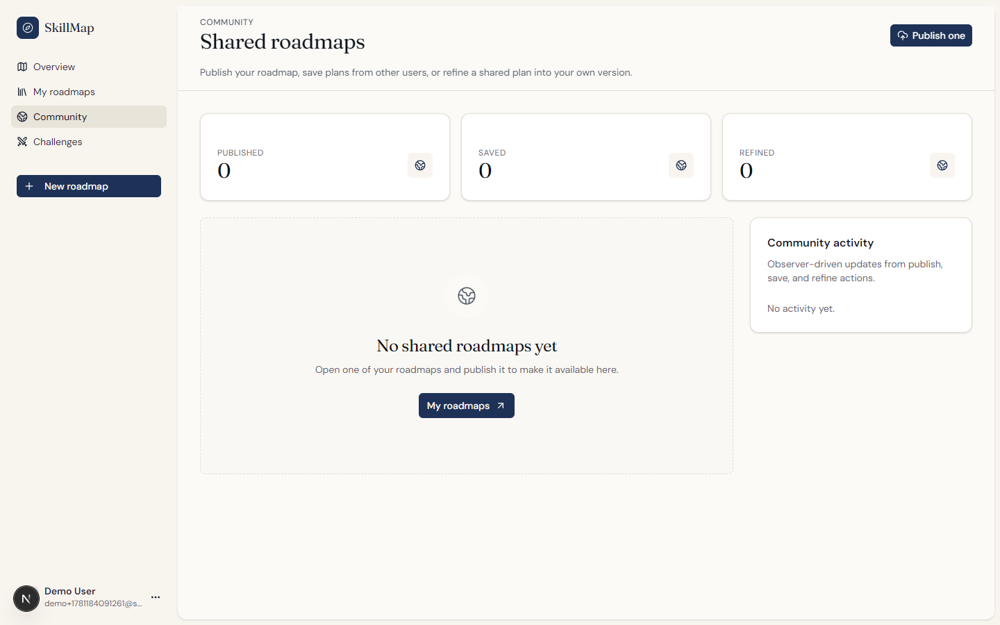
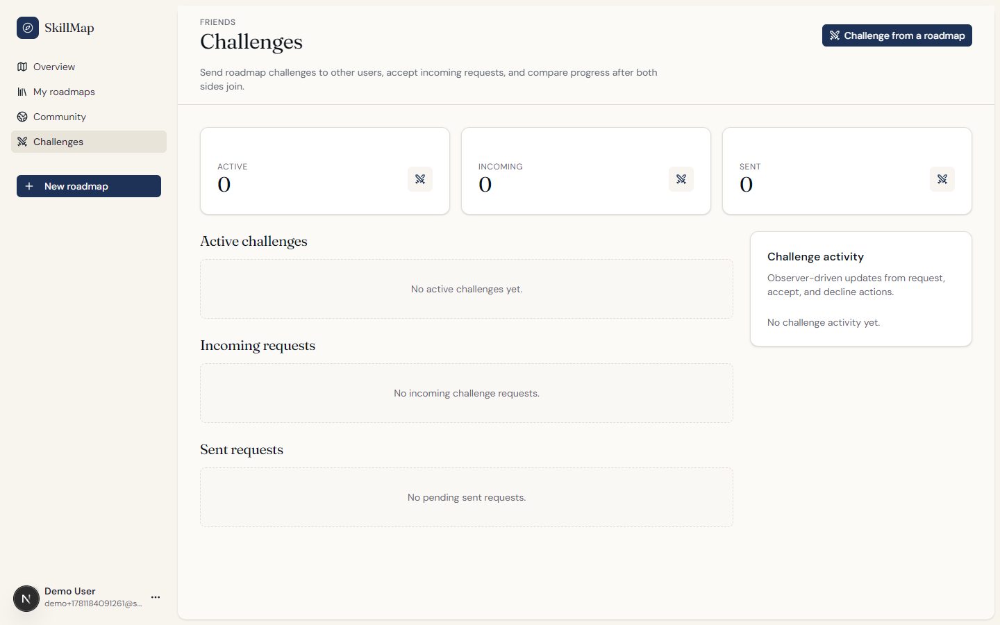
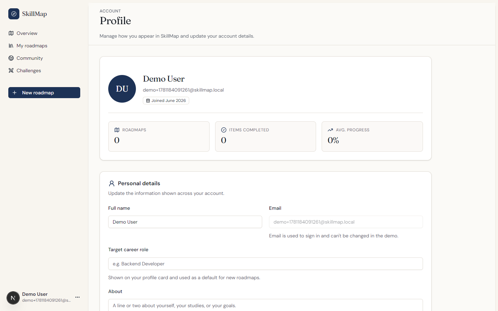

# SkillMap – Personalized Learning Roadmap Builder

## Description

SkillMap is a web app we built to help people plan out their journey. Instead of keeping your learning
plan in a random Notion doc or a half-forgotten Google Sheet, you
build it once here as a roadmap and track it as you go.

You can either start from one of our ready-made templates (Frontend,
Backend, Mobile, AI, Cloud, or Cybersecurity) or just create your own
from scratch. Either way, you can break your goal down into skills,
certifications, weekly tasks, resources, and a checklist you tick off
as you finish things.

The reason we built it is honestly pretty simple: we got tired of
jumping between YouTube playlists, blog posts, and spreadsheets every
time we wanted to learn something new. We wanted one place where you
can see the whole path, how much of it is done, and share it with
other people learning the same thing. That's basically what SkillMap
is.

It also has a small community side — you can publish a roadmap for
others to see and clone, and you can start a friendly challenge with
another learner to see who makes more progress.

## Features

### Account
- Sign up with your name, email, and password
- Log in and stay logged in
- Edit your profile (name, target role, bio)
- Change your password
- Delete your account when you're done

### Roadmap Management
- Create a custom roadmap for whatever role you're aiming for
- See all your roadmaps in one list
- Open a roadmap and look through its full structure
- Edit the title, target role, description, or status
- Delete a roadmap you no longer need
- Add skills, certifications, weekly tasks, resources, and checklist items
- Tick items off as you finish them to keep track of progress

### Verified Templates
- Browse templates for Frontend, Backend, Mobile, AI, Cloud
  Engineering, and Cybersecurity
- Clone a template into your own account and tweak it however you want
- Use a template as a starting point so you don't start from zero

### Community
- Share one of your roadmaps to the public community library
- Browse roadmaps other learners have published
- Clone any community roadmap into your account
- See the author, target role, and how many skills it has at a glance

### Challenges
- Challenge a friend to a learning race
- See both of your progress side by side
- Whoever checks off more of the shared checklist wins (sort of)

### Activity Stream
- A small live feed on the dashboard that shows recent roadmap events
- See when a roadmap was created, updated, or had an item checked off
- It's wired up using the Observer pattern on the backend (more on
  that below)

## Design Patterns

We used three GoF patterns in the backend:

- **Builder Pattern (Creational)** – `CustomRoadmap` is built through
  its inner `Builder` class (with a private constructor and
  `withTitle`, `addSkill`, `addCertification`, `addWeeklyTask`,
  `addResource`, and `build()`). A roadmap has a lot of optional
  fields, so passing them all through one giant constructor would be
  painful. The builder lets `RoadmapService` set only the parts that
  came in on the request and assemble the rest in a readable,
  step-by-step way.
- **Factory Pattern (Creational)** – `RoadmapFactory` is the one
  place that knows how to turn a request into a `Roadmap` object.
  Keeps the construction logic in a single class, so adding new
  roadmap types later is just a matter of changing the factory.
- **Observer Pattern (Behavioral)** – Whenever a roadmap changes, we
  publish an event through `RoadmapEventManager`, and any listener
  that cares can react. We have two listeners plugged in by default:
  `RoadmapActivityObserver` (drives the activity feed you see on the
  dashboard) and `RoadmapAuditObserver` (writes to the audit log).
  Adding a third one (say, email notifications) is just another
  class implementing `RoadmapObserver`.

## Application Modes

SkillMap is a full-stack web app that runs as two processes talking to
each other:

- **Web UI Mode** – A Next.js 16 / React 19 app that runs in the
  browser. This is everything the user actually clicks on: login,
  dashboard, roadmaps, community, challenges, profile.
- **REST API Mode** – A Spring Boot 3 backend serving JSON endpoints
  under `/api/*`. This is what actually stores the data.

By default the backend uses a local H2 file database, so the project
runs with zero external setup. If you want the "real" setup, the
Docker Compose config swaps H2 for PostgreSQL 15 in a container.

## Screenshots

These are actual screenshots from a working build of the app. They
live in `docs/screenshots/`.

### Sign In


### Create Account


### Dashboard


### My Roadmaps


### New Roadmap


### Community Roadmaps


### Challenges


### Profile


## Technology Stack

- **Frontend:** Next.js 16, React 19, TypeScript, Tailwind CSS 4
- **Backend:** Java 17, Spring Boot 3.2, Spring Data JPA
- **Databases:** H2 (file mode, for local dev) and PostgreSQL 15 (for
  the Docker Compose setup)
- **Design patterns:** Factory, Observer and Builder wired through Spring
- **Testing:** JUnit 5 and Spring Boot Test
- **Deployment:** Docker and Docker Compose

## Project Structure

```text
project-skillmap/
|-- skillmap-ui/       # Next.js 16 frontend (TypeScript, Tailwind)
|-- Skillmap-api/      # Spring Boot 3 REST API (Java 17, JPA)
|   |-- docker-compose.yml
|   `-- Dockerfile
|-- data/              # Local H2 database files
|-- docs/screenshots/  # README screenshots
|-- scripts/           # Helper scripts (e.g. screenshot capture)
`-- README.md
```

## Run Locally

### Prerequisites

- Node.js 20 or later
- npm
- Java 17
- (Optional) Docker and Docker Compose, if you want the PostgreSQL setup

### 1. Start the Backend

```bash
cd Skillmap-api
./mvnw spring-boot:run
```

On Windows PowerShell:

```powershell
cd Skillmap-api
.\mvnw.cmd spring-boot:run
```

The API runs at `http://localhost:8081` and uses the local H2
database by default. You can poke around the H2 console at
`http://localhost:8081/h2-console` if you want to see the raw data.

### 2. Start the Frontend

In a separate terminal:

```bash
cd skillmap-ui
npm install
npm run dev
```

Then open `http://localhost:3000` in your browser.

## Run with Docker Compose

The backend has a Docker Compose setup that runs the Spring Boot API
and a PostgreSQL 15 database together. Using Docker Compose also
qualifies for the course's Docker extra-credit.

```bash
cd Skillmap-api
docker compose up --build
```

The API is available at `http://localhost:8081`, and PostgreSQL
listens on port `5432`. To stop and clean up:

```bash
docker compose down
```

The frontend still needs to be started separately from `skillmap-ui`
with `npm run dev`.

## Generative AI Usage Disclosure

here's how we used generative AI
tools while building SkillMap.

- **Brainstorming** – Early on we bounced ideas off an AI assistant
  to figure out which features would actually be useful to a
  learner.
- **Exploring new concepts** – A few of the things in our stack were
  new to us, so we asked an AI tool to explain them in plain language
  (Next.js 16 App Router, Tailwind 4, Spring Boot 3 config, H2 in
  file mode).
- **Debugging our own code** – When we ran into a CORS error between
  the Next.js client and the Spring Boot API, a hydration warning on
  the dashboard, and a JPA lazy-loading issue in the roadmap
  endpoints, we asked for pointers and then fixed the issues
  ourselves.
- **Refactoring our own code** – We used an AI tool to help clean up
  repeated form-field components in the UI and to consolidate
  roadmap validation in the service layer. We rewrote and tested
  every line it suggested before keeping it.
- **Proofreading** – We used an AI tool to proofread this README and
  the in-app help text for grammar and clarity.

### Team Members

- Abdullah Salah
- Abdulrahman Abualenain
- Abdulaziz Alsuwailem
